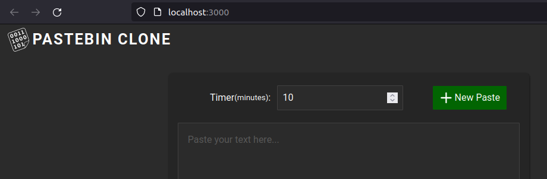
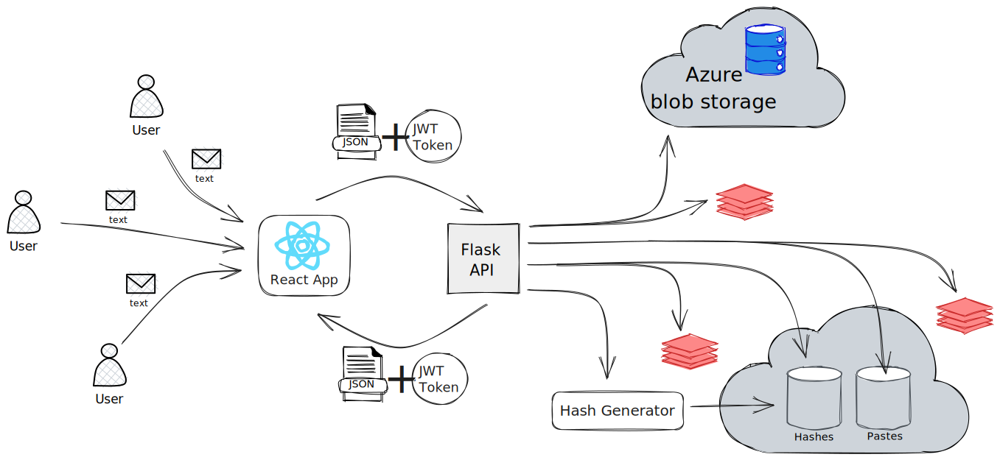
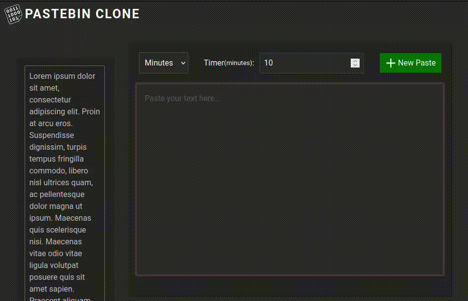
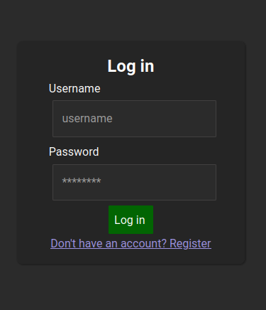
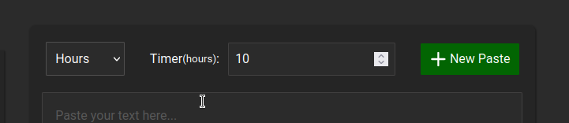
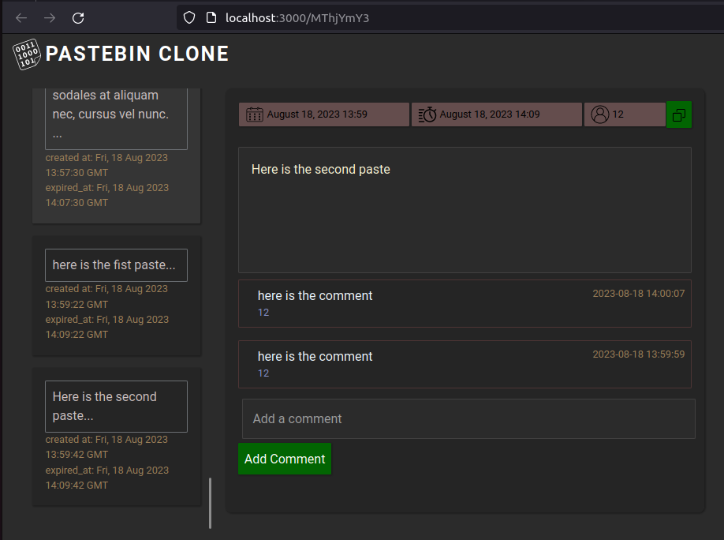

# Pastbin.com Clone WebApp


A scalable full-stack web application built using Python micro-framework Flask and JavaScript framework React. React was used to manage and show data on the front-end as well as to send requests to the back-end. The back-end was built as a regular RESTful API, which utilizes cloud solutions like Azure Blob Storage and AWS RDS (MySQL). 

This webapp is a clone of a popular text-sharing website Pastebin.com. My WebApp's Backend Architecture was build to resemble the actual architecture of the original service. The application allows users to share large amounts of text with anyone and provides additional privileges upon registration.



## Video Snippet



## Features

  
  <div style="margin-bottom: 20px;display: flex;">
  
  <p style="font-size: 25px; padding: 20px;">User authentication and authorization implemented with JWT Tokens</p>
  </div>

  <div style="margin-bottom: 20px; display: flex; flex-direction:column;">
  
  <p style="font-size: 25px; padding: 20px;">You can set the time of your paste's live availability on the service up to 365 days.</p>
  </div>

  <div style="margin-bottom: 20px; display: flex; flex-direction:column;">
  
  <p style="font-size: 25px; padding: 20px;">User can comment on other folks' pastes and track his own.</p>
  </div>
  


### Short URL Hash generation mechanism implemented using base64, which guarantees up to 8^62 unique hashes if the length == 8 chars.
```python
def generate_short_url_hash(id: str, length=8) -> str:
    # bytes-like object
    blo_object = to_bytes_like_object(id)
    hash = base64.urlsafe_b64encode(blo_object)
    short_hash = hash[-length:].decode()

    return short_hash
```
In case of any questions, please don't hesitate to contact me.

## LICENSE
[MIT](https://github.com/AdiletBaimyrza/pastebin_clone/LICENSE)
